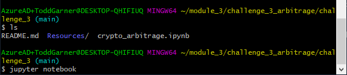
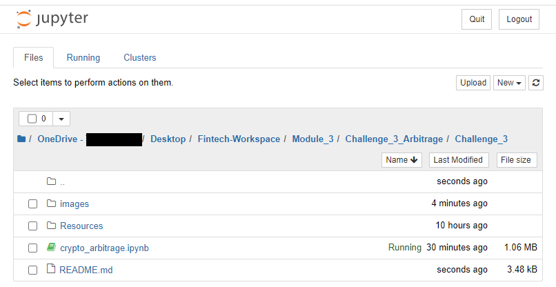

# Challenge_3_Arbitrage
The purpose of this effort is to build a Python program to find arbitrage opportunities between two different exchange markets for Bitcoin.  

Although the days of there being vast arbitrage opportunities between markets for Bitcoin are virtually over, there remains the need to build a sturdy vehicle from which one can focus on different assets and markets, potentially discovering and exploiting those arbitrage opportunities.  

Importing historical data for Bitcoin from two separate markets will guide the construction of this program.  Data sets like these are vital in running the newly built model to test for opportunity in the data and integrity in the model.  

This aspect of the Challenge will consist of 3 phases.

1. *Collect the data.*

2. *Prepare the data.*

3. *Analyze the data.*
---

## Technologies

Describe the technologies required to use your project such as programming languages, libraries, frameworks, and operating systems. Be sure to include the specific versions of any critical dependencies that you have used in the stable version of your project.

This project was completed almost entirely in Jupyter Notebook.  The README.md was modified in VS Code.  

There were three main libraries used in this project:
pandas
Path from pathlib
matplotlib (inline) - inline means:  "sets the backend of matplotlib to the 'inline' backend: With this backend, the output of plotting commands is displayed inline within frontends like the Jupyter notebook, directly below the code cell that produced it. The resulting plots will then also be stored in the notebook document" - source: https://stackoverflow.com/questions/43027980/purpose-of-matplotlib-inline#:~:text=%25matplotlib%20inline%20sets%20the%20backend,stored%20in%20the%20notebook%20document.

More information can be found regarding each of these libraries at the following links:

pandas - https://pandas.pydata.org/
Path from pathlib - https://docs.python.org/3/library/pathlib.html
matplotlib - https://matplotlib.org/

This program was written and will run on Windows 10.  

---

## Installation Guide

In this section, you should include detailed installation notes containing code blocks and screenshots.

From the Command Line in Git Bash, navigate your directory to the location of the file package.  Then, type "Jupyter Notebook" to launch the application used to write and run this program.  It's outside of the scope of this README.md file to explain the installation of Jupyter Notebook.  A screenshot of the Command Line in Git Bash is shown here:  

From Jupyter Notebook, navigate to the directory where the program is found and click on the program: "crypto_arbitrage.ipynb" as shown here in Jupyter Notebook:  

---

## Usage

This section should include screenshots, code blocks, or animations explaining how to use your project.

As it was explained in the preamble, the goal of this kind of analysis is to:
1. Collect the Data - The data is found in two separate .csv files in the /resources/ folder.  The two files: bitstamp.csv and coinbase.csv contained over 120,000 individual data points over approximately 3 months in 2018 for Bitcoin.  The data included: 

Timestamp	Open	High	Low	Close	BTC Volume	USD Volume	Weighted Price

2. Prepare the data - The data in both .csv files was scrubbed to:
    a. remove dublicates
    b. replace or drop all NaN, or missing, values
    c. make all data to be analyzed a "float" or number.  

3. Analyze the data - The data was analyzed in the following steps:
    
    a. There are two columns of data chosen to use in our analysis
        
        i. Timestamp
        ii.Close or closing price of Bitcoin 
    
    b. Describe the closing data using the .describe() function - this returns:
        
        i.      count - number of rows
        ii.     mean - average
        iii.    standard deviation
        iv.     minimum value
        v.      25% value
        vi.     50% value
        vii.    75% value
        viii.   maximum value 
    c. A plot of the data set from each of the data sets
    
    d. A combined plot overlaying both data sets in differing colors and of a size that can be analyzed on the screen in real time. 
    
    e. Slices of one month were taken of each of the two sets:
        
        i.      early - early in the date set and so on for the middle/late
        ii.     middle
        iii.    late
    
    f. Then slices chosing one day, again early, middle and late.
        
        i.      January 15, 2018
        ii.     February 15, 2018
        iii.    March 31, 2018
    g. These points in time were analyzed to describe the following:
        
        i. Look across the entire 3 months to see if there are obvious arbitrage opportunities.
        ii. Look at two separate one month periods.  One early in the time series and one later in the time series.  These were to drill down into more detail, looking for arbitrage opportunities.
        iii. Now, pick three dates:
            
            1. Early in the time series
            2. Midway through the time series
            3. Late in the time series.
    h. Plots of these days were visualized and described by a ser of analyses as described in 3.b. above.  
    
    i. Box plots were added for the three dates.
    j. Arbitrage spreads were evaluated and a 1% expense was subtraced from the gross profits on the three dates selected. The results were a bit surprising:
        
        i.      Early - spreads and profits exist
        ii.     Middle - spreads and profits do NOT exist
        iii.    Late - spread and profits do NOT exist
    
    k. A graph of the cumulative sum of the profits was plotted.  
        
        i. Total profit - $766.13.  
    

    This is not what was expected.  I think I'm just lousy at picking dates where arbitrage opportunities exist.  With more interative attempts, the optimal profit could have been achieved.  But, in real time, this could easily occur.  
    

---

## Contributors

This was done solely by Christopher Todd Garner

---

## License

Feel free to use this program and happy hunting for arbitrage profits.  Add some for loops or the like and optimal profits can be achieved.  
